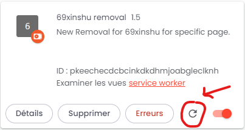
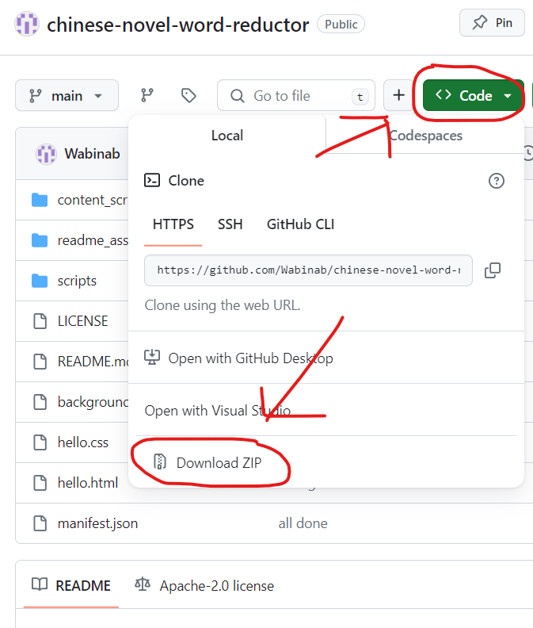
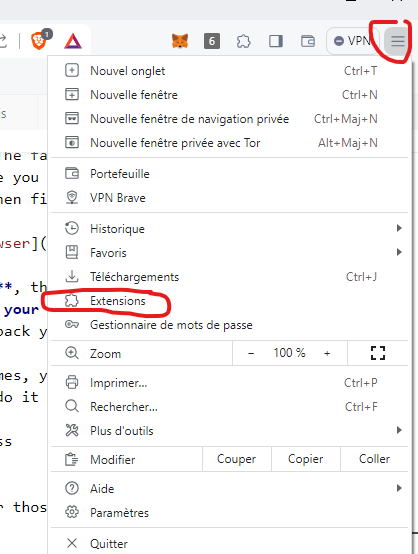
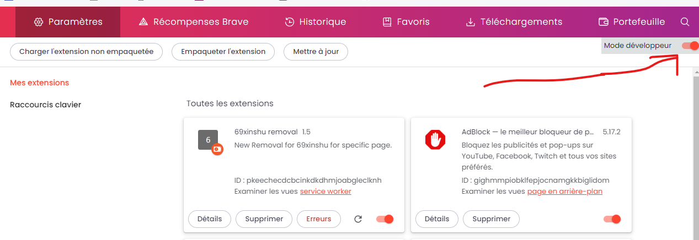
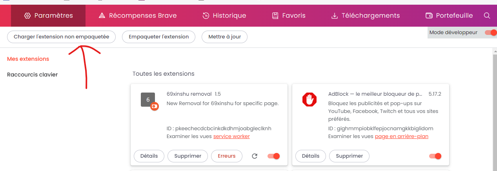

# chinese-novel-word-reductor
Some people don't know how to type paragraphs, instead, using either very short sentences or only partial sentences. These bad practices should be omitted from Chinese novels. This extension tries to remove all such text in a particular website. 

There are 2 types: "length only" and "length + speech". The former will only preserve length >= `Len Min`; while the latter will preserve the former AND include all the speech where speech >= `Speech Min`. The defaults are 47 for `Len Min`, which is about 1.5 lines on `32px` font on computer device (width larger than 720px). 

Both will preserve anything starting with `【`, as it's usually include for 系统。Of course, some writers don't open with 【 , in which case it'll be removed and you'll have to turn it off to check it. It only works in this two cases: 
```
 【姓名：陈衍】
 【境界：凡人】 
 【功德：一百】
```
and
```
 【姓名：陈衍
  境界：凡人   
  功德：一百】
```
Both, in usual case, can be detected; unless it's put on top of the page as the first line, which one haven't test if it'll work or not. 

Of course, it has additionally other stuffs, like change the background color of `ddxs` and `31xiaoshuo` site to match what one wants; but that isn't supported for the main functionality, just a sidetracked stuff that you can ignore. 

Beside the title, there is a red button on the LHS. That button is for **resubscription.** Note, when your computer shut off unexpectedly, either due to computer have problems (like mine does), or power trip, or computer too hot it shut off automatically, etc. The extension will fail. The failure sometimes are minor, like it cannot reinitialize itself back, therefore you can either use this red button, or go to your browser's `Extension -> ` then find the extension and press refresh. 



Note, the refresh above will **clear your storage**, that's why we have the red button. However, **unexpected shut down can clear your storage without warning, as tested**, so in that case, you might need to set back your settings again. 

As for the white button on the right side, sometimes, your target doesn't do its work in first stage, so you can click again to redo it second time. 

That's it for the introduction. Next, let's discuss

## How To Install
Easy. First, you'd need to clone this repo (or for those non-git user, click download zip):



Unpacked the zip file (don't need me to teach you how, right?) Then, you need to allow import this into your browser. In Brave browser, that's going to "manage your extension"



Activate developer mode



Load unpacked



Then just choose the folder where you'd unzip your file just now, probably a folder named chinese-novel-word-reductor. **If your folder have another layer, that is, this file is inside, say, `chinese-novel-word-reductor/chinese-novel-word-reductor/README.md`, then you should open the inner `chinese-novel-word-reductor` folder instead of the outer one.** That's it! 

## How To Use
When you visit a page like https://www.69xinshu.com/txt/54562/36854717, you can open the extension and click whether you want length only or length with speech. **Reload the page after updating your choice.** (If it doesn't work, check that it is ticked again. If it isn't, do it again, close the extension window, and reload again.) Now, you should see it work. 

If you restart your computer, unfortunately, the extension doesn't immediately work. You have to **open the extension window, then close it, to trigger the content script.** NOTE: this error only exist in dynamic content scripts like 69shu; but for static content script like ddxs and 31xiaoshuo, this isn't required nor reset by restarting computer normally. 

NOTE: **the setting is site specific.** E.g. going to https://www.69xinshu.com/txt/54562/36854717 will set the setting for book `54562` (see the hyperlink for this code). If you want to turn it off, you'd have to visit `54562` or meddle with extension's console (pro only) from `await chrome.storage.local.get(['length', 'len_speech'])`. 

You can change how long you want for length min (7 - 150 characters), and speech min (0 - 150 characters); and since 69shu has been changing site name frequently (from 69shu to 69shuba to 69xinshu), we allowed for you to change site name too! 

Finally, **note that this doesn't include all cases. There are some cases where the extension will fail; and certainly the extension isn't perfect in cancelling all, esp. at the starting of the page and ending of page, so you'll have to bear with the imperfection (or don't use the extension if you need perfection, for your sake).** If you note any large problems, do write an issue in [github issue](https://github.com/Wabinab/chinese-novel-word-reductor/issues). 

---
# Learnings
### Fetch tabs
Of course one can't fetch tabs with `window.location.href` as it'll get the tab for extension. Then, one use `chrome.tabs.query` instead; with one caveat: The original asked to pass in `lastFocusedWindow`, which always return `undefined`. Instead, we pass in `currentWindow` to deal with it correctly. 